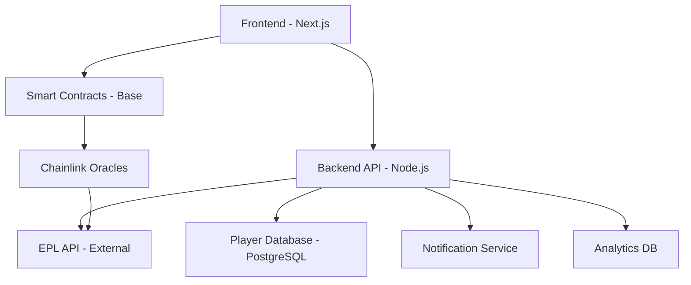

# OnChain FPL: Cost Analysis & Backend Architecture

## Cost Breakdown Analysis

### Development Phase Costs (Base Sepolia Testnet)

#### Testnet Resources - **FREE**
```
✅ Base Sepolia ETH: FREE (from faucets)
✅ Contract deployments: FREE
✅ Testing transactions: FREE
✅ Oracle testing: FREE (mock data)

Total Development Cost: $0
```

#### Required Faucets for Testing
- [Base Sepolia Faucet](https://www.coinbase.com/faucets/base-ethereum-sepolia-faucet)
- [Chainlink Sepolia Faucet](https://faucets.chain.link/base-sepolia)

### Production Deployment Costs (Base Mainnet)

#### One-Time Deployment Costs
```
Smart Contract Deployments:
├── PoolManager.sol         ~0.002 ETH  ($5-8)
├── TeamManager.sol         ~0.003 ETH  ($8-12)
├── ScoringEngine.sol       ~0.004 ETH  ($10-15)
├── OracleConsumer.sol      ~0.002 ETH  ($5-8)
└── PayoutDistributor.sol   ~0.002 ETH  ($5-8)

Total Initial Deployment: ~0.013 ETH ($33-51)
```

#### Ongoing Operational Costs

**Per Matchweek (38 times per season):**
```
Matchweek Operations:
├── Create Pool             ~0.0005 ETH ($1.25-2)
├── Oracle Data Request     ~0.002 ETH  ($5-8)
├── Process Scoring         ~0.001 ETH  ($2.50-4)
├── Distribute Payouts      ~0.0008 ETH ($2-3)
└── Update Leaderboards     ~0.0002 ETH ($0.50-1)

Per Matchweek Total: ~0.0045 ETH ($11.25-18)
Annual Operations: ~0.171 ETH ($427-684)
```

**User Transaction Costs (Paid by Users):**
```
User Actions:
├── Join Pool (pay 50 KSh)  ~0.0003 ETH ($0.75-1.20)
├── Submit Team             ~0.0008 ETH ($2-3.20)
├── Modify Team             ~0.0005 ETH ($1.25-2)
└── Withdraw Winnings       ~0.0004 ETH ($1-1.60)

Users pay their own gas fees
Platform doesn't cover user transaction costs
```

### Revenue vs Cost Analysis

**Break-Even Analysis:**
```
Monthly Operational Cost: ~$35-57
Required Participants per Matchweek: 15-20 users
Platform Fee (5% of pools): $2.50 per 20-user pool
Required Pools per Month: 14-23 pools

Conclusion: Need ~300-400 active users to break even
```

## Backend Architecture: Hybrid On-Chain/Off-Chain

### Architecture Overview



### Smart Contract Layer (On-Chain)

#### Core Business Logic - **Fully Decentralized**
```solidity
// What lives on blockchain:
contract PoolManager {
    // Pool creation and lifecycle
    mapping(uint256 => Pool) public pools;
    
    function createPool(uint256 matchweek) external;
    function joinPool(uint256 matchweek) external payable;
    function finalizePool(uint256 matchweek) external;
}

contract TeamManager {
    // Team selection and validation
    mapping(uint256 => mapping(address => Team)) teams;
    
    function submitTeam(uint256 matchweek, Team memory team) external;
    function validateTeam(Team memory team) public pure returns (bool);
}

contract ScoringEngine {
    // FPL scoring calculations
    function calculateTeamScore(uint256 matchweek, address user) 
        external view returns (uint256);
    
    function updatePlayerPerformance(uint256 playerId, Performance memory perf) 
        external onlyOracle;
}

contract PayoutDistributor {
    // Automated prize distribution
    function distributePrize(uint256 matchweek) external;
    function emergencyWithdraw() external onlyOwner;
}
```

**Why On-Chain:**
- ✅ **Trustless**: No central authority can manipulate results
- ✅ **Transparent**: All transactions publicly verifiable
- ✅ **Automated**: Smart contracts execute without human intervention
- ✅ **Immutable**: Rules can't be changed mid-game
- ✅ **Global**: Accessible from anywhere without servers

### Backend API Layer (Off-Chain)

#### Supporting Services - **Centralized for Efficiency**
```typescript
// What lives on traditional servers:

// 1. Player Database Service
interface PlayerService {
    getPlayers(): Promise<Player[]>;
    getPlayerStats(playerId: string): Promise<PlayerStats>;
    updatePlayerPrices(): Promise<void>;
}

// 2. Match Data Service  
interface MatchService {
    getFixtures(matchweek: number): Promise<Match[]>;
    getResults(matchweek: number): Promise<MatchResult[]>;
    getLiveScores(): Promise<LiveScore[]>;
}

// 3. Oracle Data Aggregator
interface OracleService {
    fetchPlayerPerformance(matchweek: number): Promise<Performance[]>;
    validateData(data: Performance[]): boolean;
    submitToChain(data: Performance[]): Promise<string>;
}

// 4. Notification Service
interface NotificationService {
    sendDeadlineReminder(userId: string): Promise<void>;
    sendScoreUpdate(userId: string, score: number): Promise<void>;
    sendWinnerNotification(userId: string, amount: number): Promise<void>;
}
```

**Why Off-Chain:**
- ⚡ **Speed**: Instant data retrieval without blockchain delays
- 💰 **Cost**: No gas fees for data queries
- 🔄 **Updates**: Real-time data updates during matches
- 📊 **Analytics**: Complex queries and reporting
- 🔔 **UX**: Push notifications and real-time updates

### Data Flow Architecture

#### Team Submission Flow
```
1. User selects team in frontend
2. Frontend validates team locally (instant feedback)
3. User pays gas + submits to TeamManager contract
4. Smart contract validates team (on-chain rules)
5. Team stored on blockchain (immutable)
6. Backend indexes team for quick queries
```

#### Scoring Flow
```
1. Matchweek ends
2. Backend fetches EPL results from API-Football
3. Oracle service aggregates and validates data
4. Chainlink oracle submits data to ScoringEngine
5. Smart contract calculates all team scores
6. PayoutDistributor automatically sends prize to winner
7. Backend updates leaderboards and sends notifications
```

### Infrastructure Requirements

#### Blockchain Infrastructure
```yaml
Base Mainnet:
  - RPC Provider: Alchemy/QuickNode ($50-100/month)
  - Oracle Services: Chainlink ($20-50/month per data feed)
  - Contract Monitoring: Tenderly ($30/month)

Total Blockchain: ~$100-180/month
```

#### Traditional Backend Infrastructure
```yaml
Backend Services:
  - Server Hosting: Railway/Render ($25-50/month)
  - Database: PostgreSQL on Supabase ($25/month)
  - CDN: Cloudflare (Free tier)
  - Monitoring: Sentry ($26/month)
  - Email/SMS: SendGrid + Twilio ($20/month)

Total Backend: ~$96-121/month
```

#### External APIs
```yaml
Data Sources:
  - API-Football: $50/month (500 requests/day)
  - FPL Official API: Free (rate limited)
  - Exchange Rates: Free tier sufficient
  - M-Pesa Integration: Transaction-based fees

Total APIs: ~$50/month
```

### Total Monthly Operating Costs

```
Infrastructure Costs:
├── Blockchain (Base + Oracles): $100-180
├── Backend Services: $96-121  
├── External APIs: $50
└── Gas Fees (Operations): $35-57

Total Monthly: $281-408
Break-even: ~400-500 active users
```

### Scaling Considerations

#### Current Architecture Limits
```
Base Layer 2 Capacity:
- Transactions per second: ~1000 TPS
- Our usage: ~50 TPS peak (during deadlines)
- Headroom: 20x current capacity

Smart Contract Limits:
- Gas limit per block: 30M gas
- Our operations: ~200k gas average
- Transactions per block: ~150 operations
```

#### Scaling Solutions
```typescript
// If we hit limits, we can:

// 1. Batch Operations
function batchSubmitTeams(Team[] memory teams) external {
    for (uint i = 0; i < teams.length; i++) {
        _submitTeam(teams[i]);
    }
}

// 2. Layer 3 Solutions
// Move to Polygon CDK or custom L3 for even lower costs

// 3. Hybrid Validation
// Basic validation on-chain, complex validation off-chain with fraud proofs
```

### Security & Decentralization Trade-offs

#### What We Gain with Hybrid Approach
- ✅ **Core Logic Decentralized**: Payments, scoring, payouts on-chain
- ✅ **Cost Efficient**: Expensive operations off-chain
- ✅ **User Experience**: Fast queries and real-time updates
- ✅ **Scalable**: Can handle thousands of users

#### What We Accept as Trade-offs
- ⚠️ **Oracle Dependency**: Rely on Chainlink for match data
- ⚠️ **Backend Dependency**: Frontend needs API for player data
- ⚠️ **Centralized Components**: Player database, notifications

#### Risk Mitigation
```typescript
// Multiple oracle sources
const oracles = [
    'chainlink-sports-data',
    'api-football-backup', 
    'manual-override-multisig'
];

// Decentralized player data (future)
// IPFS storage for player database
// Arweave for permanent match records

// Open source backend
// Community can run own instances
// Multiple backend providers possible
```

## Conclusion

**Total Launch Investment: ~$500-800**
- Development: $0 (using testnets)
- Initial deployment: $33-51
- First 3 months operations: $843-1,224
- Marketing/legal: $200-400

**Break-even Point: 400-500 active users**
- Revenue per user per month: ~$1-2 (5% platform fee)
- Monthly costs: $281-408
- Sustainable business model with moderate adoption

**Architecture Benefits:**
- **Trustless Core**: Critical functions on blockchain
- **Efficient Operations**: Supporting services off-chain  
- **Cost Optimized**: Hybrid approach minimizes gas costs
- **Scalable**: Can grow to thousands of users
- **Transparent**: All financial operations on-chain

The hybrid architecture gives us the best of both worlds: blockchain security and transparency for the core game mechanics, with traditional backend efficiency for supporting features.