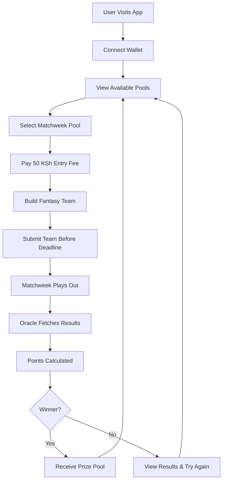
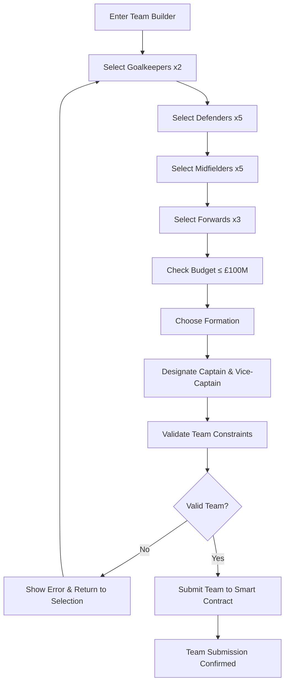
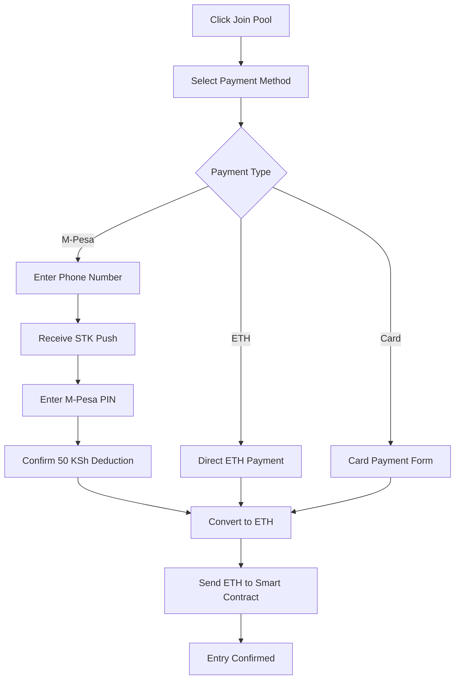
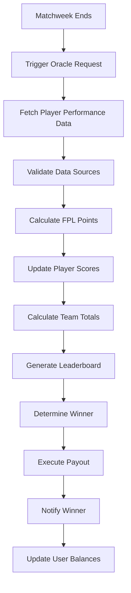

# EPL Fantasy Miniapp: Player Workflows

## Overview

The EPL Fantasy Miniapp operates on a matchweek-based cycle, perfectly synchronized with the official English Premier League schedule. Players participate in weekly pools by selecting fantasy teams following official FPL mechanics, paying a 50 KSh entry fee, and competing for the entire prize pool based on real-world player performance.

### Key Workflow Characteristics

- **Matchweek Alignment**: Each pool corresponds to an official EPL matchweek (1-38 in a season)
- **Variable Match Counts**: Pools accommodate 3-20 matches depending on fixtures, including midweek games and double gameweeks
- **FPL Team Structure**: 15-player squad with 11 starting players following official formation rules
- **Strict Deadlines**: Team selection closes 1 hour 30 minutes before the earliest match kickoff
- **Open Participation**: No player limits per pool - anyone can join before the deadline
- **Winner-Takes-All**: Highest scoring fantasy team wins the entire pool
- **Automated Payouts**: Smart contract distributes winnings automatically after oracle data confirmation

## Detailed Workflows

### 1. User Onboarding and Account Setup

#### 1.1 Initial Registration
```
Start → Connect Wallet → Verify Base Network → Create Profile → Complete Onboarding
```

**Step-by-Step Process:**
1. **Landing Page Access**: User visits the miniapp URL
2. **Wallet Connection**: Click "Connect Wallet" button to integrate MetaMask or compatible wallet
3. **Network Verification**: System checks for Base network, prompts addition if not present
4. **Profile Creation**: User provides basic information (username, display name)
5. **Terms Acceptance**: Review and accept terms of service and privacy policy
6. **Tutorial Walkthrough**: Interactive guide explaining FPL scoring system and app mechanics
7. **Account Confirmation**: Profile created and wallet address registered

**Technical Implementation:**
- Wallet connection via wagmi/viem React hooks
- Automatic network detection and switching
- Local storage for user preferences and session management
- Smart contract interaction to register user profile

### 2. Matchweek Pool Discovery and Entry

#### 2.1 Pool Selection
```
Dashboard → Browse Active Pools → Select Matchweek → View Pool Details → Join Pool
```

**Step-by-Step Process:**
1. **Dashboard Access**: User navigates to main dashboard showing available matchweeks
2. **Pool Browsing**: Display of current and upcoming matchweeks with details:
   - Matchweek number (e.g., "Matchweek 15")
   - Number of fixtures included
   - Current participant count
   - Total prize pool (50 KSh × participants)
   - Time remaining until deadline
3. **Pool Selection**: User clicks on desired matchweek pool
4. **Pool Details Review**: Comprehensive view including:
   - Match fixtures and kickoff times
   - Deadline countdown timer
   - Entry fee confirmation (50 KSh)
   - Participant list (optional privacy settings)

#### 2.2 Payment Processing
```
Select Pool → Payment Method → M-Pesa/Ramp Integration → Confirm Transaction → Entry Confirmed
```

**Step-by-Step Process:**
1. **Payment Initiation**: User clicks "Join Pool for 50 KSh" button
2. **Payment Method Selection**: Choose between:
   - Direct ETH payment (if user has sufficient Base ETH)
   - M-Pesa conversion via Ramp Network
   - Card payment through integrated gateway
3. **M-Pesa Integration Flow**:
   - Enter M-Pesa number
   - Receive STK push notification
   - Enter M-Pesa PIN
   - Confirm 50 KSh deduction
4. **ETH Conversion**: Automatic conversion to ~0.00015 ETH at current rates
5. **Smart Contract Interaction**: ETH transferred to pool contract
6. **Confirmation**: Transaction receipt and pool entry confirmation

**Technical Implementation:**
- Ramp Network SDK integration for fiat-to-crypto conversion
- Real-time exchange rate fetching for accurate ETH amounts
- Smart contract event emission for successful pool entry
- Transaction status tracking and user notification system

### 3. Fantasy Team Selection and Management

#### 3.1 Squad Building
```
Pool Entry → Team Selection Interface → Choose 15 Players → Set Formation → Designate Starting 11 → Submit Team
```

**Step-by-Step Process:**
1. **Team Builder Access**: Navigate to team selection interface after pool entry
2. **Player Database Loading**: System displays all EPL players with current information:
   - Real-world team affiliation
   - Position (GK, DEF, MID, FWD)
   - Fantasy price (following FPL pricing)
   - Recent performance statistics
   - Fixture difficulty ratings
3. **Budget Management**: £100M virtual budget display with real-time tracking
4. **Squad Selection Process**:
   - **Goalkeepers**: Select 2 goalkeepers (1 starting, 1 substitute)
   - **Defenders**: Select 5 defenders (3-5 starting depending on formation)
   - **Midfielders**: Select 5 midfielders (2-5 starting depending on formation)
   - **Forwards**: Select 3 forwards (1-3 starting depending on formation)
5. **Formation Selection**: Choose from valid FPL formations:
   - 3-4-3, 3-5-2, 4-3-3, 4-4-2, 4-5-1, 5-3-2, 5-4-1
6. **Captain and Vice-Captain**: Designate captain (double points) and vice-captain
7. **Team Validation**: System checks:
   - Total cost ≤ £100M
   - Correct number of players per position
   - Maximum 3 players from same real EPL team
   - Valid formation constraints
8. **Team Submission**: Final review and confirmation of team selection

**Technical Implementation:**
- React components for interactive team selection
- Real-time budget calculation and validation
- Player data fetching from FPL API or cached database
- Form validation for all FPL constraints
- Local state management for team building process

#### 3.2 Team Modification (Before Deadline)
```
View Current Team → Modify Players → Update Formation → Revalidate Team → Resubmit Changes
```

**Step-by-Step Process:**
1. **Team Review**: Access current team through user dashboard
2. **Modification Interface**: Edit team with same constraints as initial selection
3. **Change Tracking**: System highlights modifications from previous submission
4. **Deadline Monitoring**: Prominent countdown timer showing time remaining
5. **Final Submission**: New team overwrites previous selection in smart contract
6. **Confirmation**: Updated team confirmation with timestamp

### 4. Matchweek Monitoring and Scoring

#### 4.1 Live Matchweek Tracking
```
Matchweek Starts → Real-Time Updates → Player Performance Tracking → Live Scoring → Leaderboard Updates
```

**Step-by-Step Process:**
1. **Matchweek Commencement**: First match of the matchweek kicks off
2. **Team Locking**: No further modifications allowed after deadline
3. **Live Updates**: Real-time information display:
   - Match scores and times
   - Individual player performances (goals, assists, cards, etc.)
   - Provisional fantasy points for user's players
   - Live leaderboard rankings
4. **Performance Notifications**: Push notifications for significant events affecting user's team
5. **Progress Tracking**: Visual indicators showing matches completed vs. remaining

#### 4.2 Oracle Data Integration and Final Scoring
```
Matchweek Completion → Oracle Data Fetch → Point Calculation → Final Leaderboard → Winner Determination
```

**Step-by-Step Process:**
1. **Matchweek Conclusion**: All matches in the matchweek completed
2. **Oracle Trigger**: Automated Chainlink oracle request for official match data
3. **Data Validation**: Cross-reference multiple data sources for accuracy
4. **Point Calculation**: Smart contract implements FPL scoring system:
   - **Goals**: GK/DEF: 6 points, MID: 5 points, FWD: 4 points
   - **Assists**: All positions: 3 points
   - **Clean Sheets**: GK/DEF: 4 points, MID: 1 point
   - **Playing Time**: 2 points for >60 minutes, 1 point for <60 minutes
   - **Bonus Points**: Based on FPL bonus point system
   - **Captain Bonus**: Double points for captain, single points for vice-captain if captain doesn't play
   - **Penalties**: Yellow cards (-1), red cards (-3), own goals (-2), penalties missed (-2)
5. **Final Leaderboard**: Complete ranking of all participants
6. **Winner Announcement**: Highest scoring team declared winner

### 5. Payout and Rewards Distribution

#### 5.1 Automated Prize Distribution
```
Winner Determination → Smart Contract Payout → Winner Notification → Transaction Confirmation → Balance Update
```

**Step-by-Step Process:**
1. **Winner Verification**: Smart contract confirms highest scoring team
2. **Prize Pool Calculation**: Total ETH collected from all participants
3. **Automatic Transfer**: Winner's wallet receives full prize pool via smart contract
4. **Transaction Recording**: Blockchain transaction hash generated and recorded
5. **Winner Notification**: Push notification and email to winning player
6. **Public Announcement**: Winner announced on leaderboard with privacy options
7. **Balance Update**: Winner's account balance updated in real-time

#### 5.2 Earnings Management
```
View Earnings → Check Transaction History → Withdraw Funds → Convert to KSh (Optional)
```

**Step-by-Step Process:**
1. **Earnings Dashboard**: Display total winnings, current balance, and transaction history
2. **Withdrawal Options**:
   - Keep ETH in wallet for future pool entries
   - Convert back to KSh via integrated off-ramp services
   - Transfer to external wallets
3. **Transaction History**: Complete record of entries, winnings, and withdrawals
4. **Tax Information**: Basic guidance on potential tax implications (disclaimer-based)

## Workflow Diagrams

### User Journey Overview


### Team Selection Process


### Payment Flow


### Oracle and Scoring Workflow


## Edge Cases and Error Handling

### 1. Tie Scenarios
**Situation**: Multiple players achieve the same highest score
**Resolution**:
- Smart contract implements tie-breaking logic:
  1. Highest bench score (non-playing players' points)
  2. Most goals scored by team
  3. Fewest cards received by team
  4. If still tied, split prize pool equally among winners
- Automated equal distribution via smart contract
- All tied winners receive notification and payout

### 2. No Participants Scenario
**Situation**: No players join a matchweek pool
**Resolution**:
- Pool automatically cancelled if no entries by deadline
- Contingency pools created for popular matchweeks
- Marketing campaigns to ensure minimum participation
- Rollover mechanism for unclaimed pools

### 3. Missed Deadline Submissions
**Situation**: Player attempts to submit team after deadline
**Resolution**:
- Smart contract enforces strict deadline via block timestamp
- Frontend displays clear countdown timer and warnings
- Grace period warnings at 30 minutes, 15 minutes, and 5 minutes before deadline
- No exceptions - missed deadlines result in no entry
- Entry fee refund if payment processed but team not submitted in time

### 4. Invalid Team Selections
**Situation**: Player submits team violating FPL constraints
**Resolution**:
- **Budget Exceeded**: Frontend prevents submission, highlights expensive players
- **Formation Violations**: Real-time validation with error messages
- **Duplicate Players**: System prevents selection of same player twice
- **Team Limitations**: Automatic enforcement of max 3 players per EPL team
- **Smart Contract Validation**: Final check at submission with revert if invalid

### 5. Oracle Data Failures
**Situation**: Chainlink oracle fails to fetch or provides incorrect data
**Resolution**:
- Multiple oracle sources with consensus mechanism
- Manual override capability for emergencies (multi-sig required)
- Delayed payout with notification to participants
- Refund mechanism if data cannot be resolved within 48 hours
- Backup data sources (API-Football, official FPL API)

### 6. Double Gameweeks and Fixture Changes
**Situation**: EPL reschedules matches or creates double gameweeks
**Resolution**:
- Flexible pool structure accommodating fixture changes
- Extended deadline for double gameweeks
- Automatic team eligibility for all matches in the extended period
- Clear communication about fixture changes and their impact
- Option to create separate pools for rescheduled matches

### 7. Smart Contract Emergencies
**Situation**: Critical bug or exploit discovered in smart contract
**Resolution**:
- Emergency pause functionality (owner-only)
- Immediate halt to new entries and team submissions
- User fund protection via escrow mechanisms
- Clear communication about status and resolution timeline
- Insurance fund for potential losses
- Upgrade mechanism for contract improvements

### 8. Payment Processing Failures
**Situation**: M-Pesa payment succeeds but ETH conversion fails
**Resolution**:
- Payment status tracking with detailed logging
- Automatic retry mechanisms for failed conversions
- Manual intervention process for stuck payments
- Full refund to M-Pesa if conversion cannot be completed
- Alternative payment methods as backup options
- Customer support integration for payment issues

### 9. Blockchain Network Issues
**Situation**: Base network congestion or downtime
**Resolution**:
- Network status monitoring and user notifications
- Transaction retry mechanisms with higher gas prices
- Extended deadlines during network issues (community vote)
- Alternative submission methods during emergencies
- Comprehensive incident response plan
- Communication channels for status updates

### 10. Regulatory Compliance Issues
**Situation**: Kenyan authorities raise concerns about the gaming mechanics
**Resolution**:
- Legal classification as skill-based game, not gambling
- Compliance documentation and legal opinions
- User age verification (18+ only)
- Responsible gaming features and limitations
- Cooperation with regulatory authorities
- Ability to restrict access if required by law